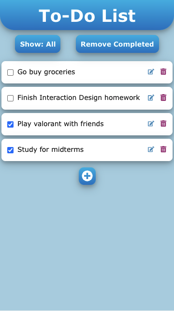

## Design Decisions:
The largest design decision made was regarding how to store our data (the structure of the firestore schema).

Another deisgn decision we made in this iteration was how to display the priority of a list item to the user.

A final design decision we made in this iteration was how we would allow the user to change

CHANGE THIS PIC ONCE FINISHED

## Alternative Designs:

Our alternative designs are the same as in Lab 1. We came up with these designs individually, then came together to discuss the pros and cons of each. We obviously did not implement each in React, rather only implementing the final design in React after much planning and whiteboarding.

One aspect that we especially had to talk about was the way that users would edit/add items. Once a user clicks the plus button or edit icon, we were wondering the best way that would allow them to enter the text. One option was to have an input text box directly on the list item, but we found this to be a bit ugly. Instead, we went with a modal approach. Thus, a modal pops up that allows them to type their text and then once they save, the item is edited or added.

One additional alternative design was to have item background color changes for the priority, instead of our current design of having a small color tab on the side of the item. However, we had a difficult time finding colors suitable for this. We believe the white background of the item fits the light blue background of the app background. The small priority tab color is enough of an indicator that does not mess with the color scheme.

## User Testing:

## Challenges:
One challenge was getting firebase hosting to work properly.

## Parts Of Design We Are Proud Of: