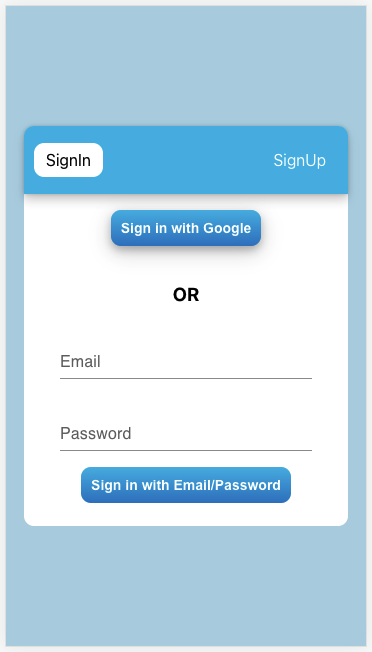
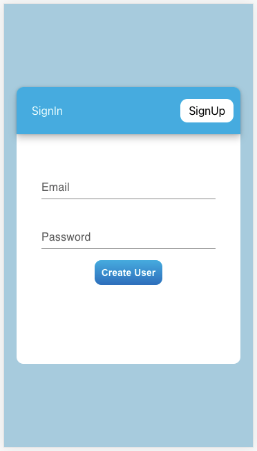
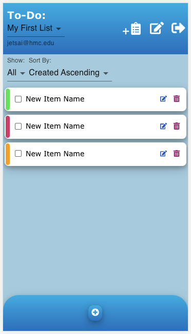

## Design Decisions:
One of the main design decisions we had was figuring out how we wanted to lay out our sign up/sign in page. There were multiple variations we could've done, like having a separate page with tabs, having separate pages for sign up/sign in, and also keeping the sign up/sign in within the main app page. For organizational purposes, we decided to go with having a separate page with two tabs, one for signing in and one for signing up.

Regarding sharing functionality, we simply added a sharedWith array to every list document and this array stores the emails of the users that the list is shared with. Thus, when users try to share a specific list, they are met with a modal that asks for an email input. After sharing with user X, the list should appear under "Shared Lists" of user X. Note that initially, we had it so that you needed a verified email to view the shared list. However, we were having difficulty getting it to work with security rules because of how the query did not know the current user was verified. Thus, we kept it simple and made it so that verified and non-verified users could view shared lists. For a shared list, we made it so that you could add/edit/delete items from it but could not rename or delete the list. A shared list can also not be shared to others by the person that it was shared with. We created corresponding security rules in the security rules console of Firestore to make sure that illegal actions could not happen (for example, to read a list, you must be signed in and either own the list or be shared with it).

Below are some images of our sign in/sign up pages and main app.

## Alternative Designs:
One alternative design we were thinking of was, instead of tabs for the sign up/sign in pages, we could have them all in one page. However, we found this to be too cluttered and thought that separating them into two different tabs would help oragnize functionality for the user and prevent confusion.

## User Testing:
For user testing, we again followed the guidelines stated in the readings.

User 1: The first user noted that they liked how we had two separate tabs for signing up and signing in. On the sign in page, they liked how we clearly depicted that you could sign in with Google OR provide a username and password. Because of this, they found the sign up/sign in flow simple and intuitive. This user also mentioned that sharing lists was easy through the clear share icon which then allows them to input a user email. The user did ask about whether the emails input went through validation (which they don't), but in the future when we have more time, we could add an indicator to see if the entered email is valid.

User 2: The second user also believed the sign up/sign in process was very straightforward. They also paid attention to how we display the email of the owning user of the current list, which may be helpful to quickly know whether you own this list or not. Furthermore, they appreciated how our list select dropdown separates between "My Lists" and "Shared Lists". Since we have tested with this user multiple times for the last few labs, they did not have much else to say.

## Challenges:
Overall, this lab was not too challenging. Since our schema was already prepared for sharing (we only had to add the sharedWith array), it was not difficult to add the sharing functionality. The sign up/sign in part was also not difficult because we did something very similar in class. Perhaps the most challenging part of this lab was debugging the security rules since when one was violated, we only saw the "missing or insufficient permissions" error and had to figure out why exactly this was happening. Furthermore, there was a weird error with querying the subcollection of a newly added document, which we noted in the comments of the db.rules file. This took a bit of searching online and testing blindly in the rules console, but in the end we were able to figure it out.

## Parts Of Design We Are Proud Of:
We are proud of how we were able to add sign up/sign in to our app and make it so that an individual user can keep track of their own lists as well as shared lists. The sign up/sign in functionality is prevalent across various web apps so making this work successfully is good practice for our future industry work.
